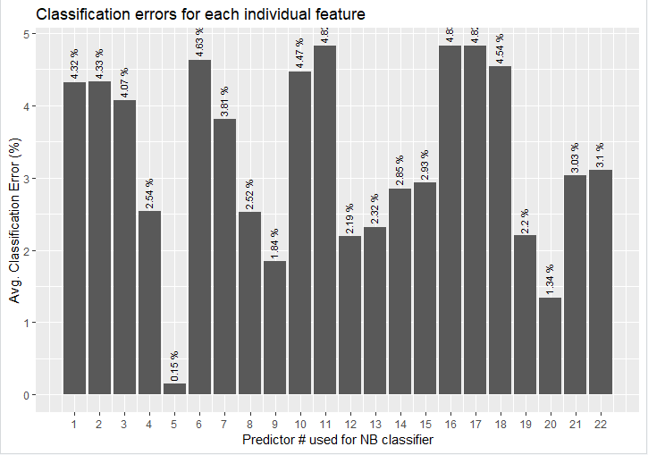
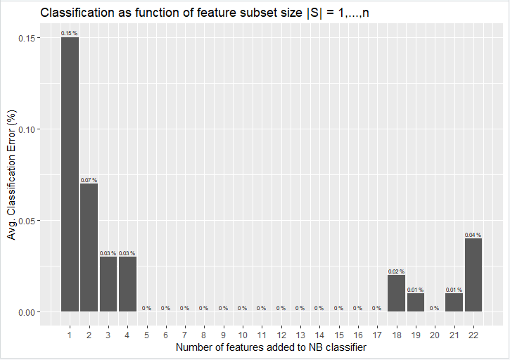

1 – Quick EDA 
--------------

The UCI Mushroom dataset consists of the following predictors and the liberty
has been taken to name them as such in the assessment’s associated R-code.

Table 1 - UCI Mushroom Dataset Predictors

| No | Predictor Name and possible values                                                                                  | Type        |
|----|---------------------------------------------------------------------------------------------------------------------|-------------|
| 1  | **cap-shape**: bell=b,conical=c,convex=x,flat=f, knobbed=k,sunken=s                                                 | Categorical |
| 2  | **cap-surface**: fibrous=f,grooves=g,scaly=y,smooth=s                                                               | Categorical |
| 3  | **cap-color:** brown=n,buff=b,cinnamon=c,gray=g,green=r, pink=p,purple=u,red=e,white=w,yellow=y                     | Categorical |
| 4  |  **bruises**: bruises=t,no=f                                                                                        | Categorical |
| 5  | **odor:** almond=a,anise=l,creosote=c,fishy=y,foul=f, musty=m,none=n,pungent=p,spicy=s                              | Categorical |
| 6  | **gill-attachment: attached**=a,descending=d,free=f,notched=n                                                       | Categorical |
| 7  | **gill-spacing**: close=c,crowded=w,distant=d                                                                       | Categorical |
| 8  | **gill-size**: broad=b,narrow=n                                                                                     | Categorical |
| 9  | **gill-color:** black=k,brown=n,buff=b,chocolate=h,gray=g, green=r,orange=o,pink=p,purple=u,red=e, white=w,yellow=y | Categorical |
| 10 | **stalk-shape**: enlarging=e,tapering=t                                                                             | Categorical |
| 11 | **stalk-root**: bulbous=b,club=c,cup=u,equal=e, rhizomorphs=z,rooted=r,missing=?                                    | Categorical |
| 12 | **stalk-surface-above-ring**: fibrous=f,scaly=y,silky=k,smooth=s                                                    | Categorical |
| 13 | **stalk-surface-below-ring**: fibrous=f,scaly=y,silky=k,smooth=s                                                    | Categorical |
| 14 | **stalk-color-above-ring**: brown=n,buff=b,cinnamon=c,gray=g,orange=o, pink=p,red=e,white=w,yellow=y                | Categorical |
| 15 | **stalk-color-below-ring**: brown=n,buff=b,cinnamon=c,gray=g,orange=o, pink=p,red=e,white=w,yellow=y                | Categorical |
| 16 | **veil-type**: partial=p,universal=u                                                                                | Categorical |
| 17 | ** veil-color**: brown=n,orange=o,white=w,yellow=y                                                                  | Categorical |
| 18 | ** ring-number**: none=n,one=o,two=t                                                                                | Categorical |
| 19 | ** ring-type**: cobwebby=c,evanescent=e,flaring=f,large=l, none=n,pendant=p,sheathing=s,zone=z                      | Categorical |
| 20 | **spore-print-color**: black=k,brown=n,buff=b,chocolate=h,green=r, orange=o,purple=u,white=w,yellow=y               | Categorical |
| 21 | **population**: abundant=a,clustered=c,numerous=n, scattered=s,several=v,solitary=y                                 | Categorical |
| 22 | **habitat**: grasses=g,leaves=l,meadows=m,paths=p, urban=u,waste=w,woods=d                                          | Categorical |

The UCI Mushroom dataset contains one dependant variable as listed in Table 2:

Table 2 - UCI Mushroom Dataset - Dependant Varible

| No | Dependant variable and possible values | Type        |
|----|----------------------------------------|-------------|
| 1  | class: e=edible, p=poisonous           | Categorical |

The UCI Mushroom dataset contains 8124 observations.

**2 - Implementation Methodology for Wrapper Naïve Bayes**

The *naive_bayes()* function in the *naivebayes* package was used to implement
the wrapper. The dataset was read in directly from the UCI website and column
names as listed in Table 1 and Table 2 were assigned upon consuming the data.

The wrapper was implemented according to a forward stepwise subset selection
(**prune later scheme**). A utility function called, *calc_classifier_error*
(see APPENDIX B), was implemented, that randomly split each candidate
classifier’s data into a training subset and a test subset containing 80% and
20% of the observations, respectively. This procedure was repeated 10 times –
each time calculating the prediction error for the classifier - the final error
of the candidate classifier was then averaged over the 10 attempts and used to
rank the classifier against other candidate classifiers.

An initial run was performed to calculate what the average classification errors
were for when each predictor was used on its own. For example:

class \~ cap-shape,

class \~ cap-surface,

class \~ cap_color,

etc.

The error list obtained from this step was ordered in ascending order. This list
served as input to a second process, which iteratively built formula strings
that served as subsets of features from which classifier were generated. From
this list the predictor with the smallest error (top of the list) was placed in
the first position of the formula string and then each subsequent predictor was
in turn added to the string and then applied to the naïve_bayes() function. For
example:

class \~ **odor** + cap-shape,

class \~ **odor** + cap-surface,

class \~ **odor** + cap-color,

etc.

All the errors that were calculated for these combinations were again captured
in a list and ordered in ascending order. The top candidate was then used as the
initial base for the third iterations. For example:

class \~ **odor + spore_print_color** + stalk_color_above_ring,

class \~ **odor + spore_print_color** + ring_type,

etc.

This process was repeated iteratively until all the predictors were exhausted
and a final ordered list was obtained. The full list can be viewed in **APPENDIX
– A**. Plots were then generated for the ordered feature set \|S\| = 1, …, *n*.
Refer to **APPENDIX - B** for the full R-code listing.

Essentially, two data frames of predictors are maintained during the forward
iteration process. Top listed feature candidates are transferred from the one
data frame to the other as they are tested. Candidate subsets are built for the
next iteration by reading the features in a sequential order from the one list
and then iteratively adding a next feature from the other list. The stop
criteria are when the second list is exhausted, and the first list contains all
of the features and ranked in order. This means the first feature in the data
frame would be considered the most efficient feature when measured on its own
(\|S\|=1). The second feature would be considered the most effective when
measured in conjunction with the first feature (\|S\| = 1+2). The third feature
would be considered the most effective when measured in conjunction with the
first and second features (\|S\|=1+2+3), etc.

**3 – Results**

Figure 1 displays the average classification error for each predictor tested
individually. The predictor number on the x-axis corresponds to the numbers in
Table 1. From Figure 1 it can be clearly observed that predictor no.5 (odor, as
listed in Table 1), is the feature that resulted in the smallest classification
error – 0.15%. This feature alone fares much better compared to the whole
feature set of 22 features that yielded a classification error of 0.4%. The top
three features from Figure 1 are:

-   5 – Odor – 0.15%

-   20 – Spore Print Color – 1.34%

-   9 – Gill Color – 1.84%

The rest of the features all produce individual classification error rates of
between 2% and 5%.



Figure 1 - Individual predictor errors

Plotting the fully ordered feature set as obtained from the output in APPENDIX –
A yields the following figure:



Figure 2 - Classification as function of feature subset \|S\|

From Figure 2 it can be observed what the overall classification error is for
each addition of optimally selected feature that was sequentially added and
tested. For example, the top feature that yielded the smallest classification
error of 0.15% (feature no.5 - odor), is indicated by the bar positioned at 1
(subset 1: class \~ odor). The second bar indicates the second subset’s
cumulative classification error (subset 2: class \~ odor + spore_print_color),
which reduces the classification error to 0.07%. By adding a third predictor,
the classification error is again reduced by half to yield an error of only
0.03%. From this we can draw the conclusion that by optimally selecting features
a classification error of at least an order of magnitude better can be achieved
by a mere 3 features (subset 3: class \~ odor + spore_print_color +
stalk_color_above_ring) against a full feature set of 22. From a statistical
point of view one can safely deduce that these three features are the most
statistically relevant features in the set of 22 features.

As additional features are added to the subsets it can be observed that between
the 5th and 17th feature added, the classifiers reach a 0% average error rate.
Might this be due to overfitting? From the 18th to the 22nd feature added to the
model one can see that non-zero error rates are starting to occur again. This
could indicate that the model has become too complex again and therefore less
efficient.

The output in APPENDIX-A suggests that the most optimal feature selection
candidate is subset 5, which yields a classification error of 0% by utilising
only the following five features (Subset (S)):

*class \~ odor + spore_print_color + stalk_color_above_ring + ring_type +
stalk_surface_above_ring*

The above subset of features is easier to understand and grasp and makes it a
lot easier to identify edible mushrooms when one is roaming around in the great
outdoors. In fact, if one had to choose only one feature then it would be odor
(predictor no.5). Like the saying goes, “If it smells off, then don’t eat it…”
That way I have 0.15% chance of incorrectly identifying a poisonous mushroom.
And, in the words of one of the greatest philosophers of all time – Homer
Simpson, “*I like those odds.”*

Alternative to the brut-force method applied via the forward stepwise subset
selection - **prune later scheme**, one can contemplate applying statistical
tests of significance to the set of 22 features. One such scheme, for instance,
might very well be χ2-test. The χ2-test, according to popular demand, is highly
suitable for determining statistical significance on features sets that are of
the categorical type.

The conclusion regarding this experiment is that *more = less.* Only a small
subset of the features (\<30%) has proven to be statistically significant enough
to produce a near zero classification error rate.

**Bonus:** As an additional thought, it would be interesting to see if cluster
analysis would be able to identify clusters of mushrooms with similar traits? If
so, what would those cluster signify? Different mushroom species?

**APPENDIX – A**

[1] "Iteration: 2"

[1] "Subset(S): class \~ odor + spore_print_color"

[1] "Avg. Error: 0.00073891625615764 ( 0.07 %)"

[1] "----------------------------------"

[1] "Iteration: 3"

[1] "Subset(S): class \~ odor + spore_print_color + stalk_color_above_ring"

[1] "Avg. Error: 0.00030788177339901 ( 0.03 %)"

[1] "----------------------------------"

[1] "Iteration: 4"

[1] "Subset(S): class \~ odor + spore_print_color + stalk_color_above_ring +
ring_type"

[1] "Avg. Error: 0.00030788177339901 ( 0.03 %)"

[1] "----------------------------------"

[1] "Iteration: 5"

[1] "Subset(S): class \~ odor + spore_print_color + stalk_color_above_ring +
ring_type + stalk_surface_above_ring"

[1] "Avg. Error: 0 ( 0 %)"

[1] "----------------------------------"

[1] "Iteration: 6"

[1] "Subset(S): class \~ odor + spore_print_color + stalk_color_above_ring +
ring_type + stalk_surface_above_ring + veil_color"

[1] "Avg. Error: 0 ( 0 %)"

[1] "----------------------------------"

[1] "Iteration: 7"

[1] "Subset(S): class \~ odor + spore_print_color + stalk_color_above_ring +
ring_type + stalk_surface_above_ring + veil_color + ring_number"

[1] "Avg. Error: 0 ( 0 %)"

[1] "----------------------------------"

[1] "Iteration: 8"

[1] "Subset(S): class \~ odor + spore_print_color + stalk_color_above_ring +
ring_type + stalk_surface_above_ring + veil_color + ring_number + veil_type"

[1] "Avg. Error: 0 ( 0 %)"

[1] "----------------------------------"

[1] "Iteration: 9"

[1] "Subset(S): class \~ odor + spore_print_color + stalk_color_above_ring +
ring_type + stalk_surface_above_ring + veil_color + ring_number + veil_type +
bruises"

[1] "Avg. Error: 0 ( 0 %)"

[1] "----------------------------------"

[1] "Iteration: 10"

[1] "Subset(S): class \~ odor + spore_print_color + stalk_color_above_ring +
ring_type + stalk_surface_above_ring + veil_color + ring_number + veil_type +
bruises + cap_surface"

[1] "Avg. Error: 0 ( 0 %)"

[1] "----------------------------------"

[1] "Iteration: 11"

[1] "Subset(S): class \~ odor + spore_print_color + stalk_color_above_ring +
ring_type + stalk_surface_above_ring + veil_color + ring_number + veil_type +
bruises + cap_surface + cap_color"

[1] "Avg. Error: 0 ( 0 %)"

[1] "----------------------------------"

[1] "Iteration: 12"

[1] "Subset(S): class \~ odor + spore_print_color + stalk_color_above_ring +
ring_type + stalk_surface_above_ring + veil_color + ring_number + veil_type +
bruises + cap_surface + cap_color + stalk_root"

[1] "Avg. Error: 0 ( 0 %)"

[1] "----------------------------------"

[1] "Iteration: 13"

[1] "Subset(S): class \~ odor + spore_print_color + stalk_color_above_ring +
ring_type + stalk_surface_above_ring + veil_color + ring_number + veil_type +
bruises + cap_surface + cap_color + stalk_root + population"

[1] "Avg. Error: 0 ( 0 %)"

[1] "----------------------------------"

[1] "Iteration: 14"

[1] "Subset(S): class \~ odor + spore_print_color + stalk_color_above_ring +
ring_type + stalk_surface_above_ring + veil_color + ring_number + veil_type +
bruises + cap_surface + cap_color + stalk_root + population + gill_attachment"

[1] "Avg. Error: 0 ( 0 %)"

[1] "----------------------------------"

[1] "Iteration: 15"

[1] "Subset(S): class \~ odor + spore_print_color + stalk_color_above_ring +
ring_type + stalk_surface_above_ring + veil_color + ring_number + veil_type +
bruises + cap_surface + cap_color + stalk_root + population + gill_attachment +
gill_color"

[1] "Avg. Error: 0 ( 0 %)"

[1] "----------------------------------"

[1] "Iteration: 16"

[1] "Subset(S): class \~ odor + spore_print_color + stalk_color_above_ring +
ring_type + stalk_surface_above_ring + veil_color + ring_number + veil_type +
bruises + cap_surface + cap_color + stalk_root + population + gill_attachment +
gill_color + stalk_shape"

[1] "Avg. Error: 0 ( 0 %)"

[1] "----------------------------------"

[1] "Iteration: 17"

[1] "Subset(S): class \~ odor + spore_print_color + stalk_color_above_ring +
ring_type + stalk_surface_above_ring + veil_color + ring_number + veil_type +
bruises + cap_surface + cap_color + stalk_root + population + gill_attachment +
gill_color + stalk_shape + habitat"

[1] "Avg. Error: 0 ( 0 %)"

[1] "----------------------------------"

[1] "Iteration: 18"

[1] "Subset(S): class \~ odor + spore_print_color + stalk_color_above_ring +
ring_type + stalk_surface_above_ring + veil_color + ring_number + veil_type +
bruises + cap_surface + cap_color + stalk_root + population + gill_attachment +
gill_color + stalk_shape + habitat + stalk_surface_below_ring"

[1] "Avg. Error: 0.000184729064039413 ( 0.02 %)"

[1] "----------------------------------"

[1] "Iteration: 19"

[1] "Subset(S): class \~ odor + spore_print_color + stalk_color_above_ring +
ring_type + stalk_surface_above_ring + veil_color + ring_number + veil_type +
bruises + cap_surface + cap_color + stalk_root + population + gill_attachment +
gill_color + stalk_shape + habitat + stalk_surface_below_ring + gill_spacing"

[1] "Avg. Error: 0.000123152709359609 ( 0.01 %)"

[1] "----------------------------------"

[1] "Iteration: 20"

[1] "Subset(S): class \~ odor + spore_print_color + stalk_color_above_ring +
ring_type + stalk_surface_above_ring + veil_color + ring_number + veil_type +
bruises + cap_surface + cap_color + stalk_root + population + gill_attachment +
gill_color + stalk_shape + habitat + stalk_surface_below_ring + gill_spacing +
gill_size"

[1] "Avg. Error: 0 ( 0 %)"

[1] "----------------------------------"

[1] "Iteration: 21"

[1] "Subset(S): class \~ odor + spore_print_color + stalk_color_above_ring +
ring_type + stalk_surface_above_ring + veil_color + ring_number + veil_type +
bruises + cap_surface + cap_color + stalk_root + population + gill_attachment +
gill_color + stalk_shape + habitat + stalk_surface_below_ring + gill_spacing +
gill_size + cap_shape"

[1] "Avg. Error: 0.000123152709359609 ( 0.01 %)"

[1] "----------------------------------"

[1] "Iteration: 22"

[1] "Subset(S): class \~ odor + spore_print_color + stalk_color_above_ring +
ring_type + stalk_surface_above_ring + veil_color + ring_number + veil_type +
bruises + cap_surface + cap_color + stalk_root + population + gill_attachment +
gill_color + stalk_shape + habitat + stalk_surface_below_ring + gill_spacing +
gill_size + cap_shape + stalk_color_below_ring"

[1] "Avg. Error: 0.000369458128078815 ( 0.04 %)"

[1] "----------------------------------"

